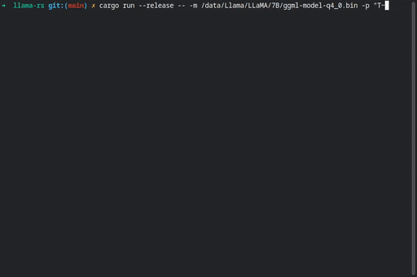

> Do the LLaMA thing, but now in Rust 🦀🚀🦙



[](https://ko-fi.com/F1F8DNO5D)

[](https://crates.io/crates/llama_rs)

**Llama-rs** is a Rust port of the
[llama.cpp](https://github.com/ggerganov/llama.cpp) project. This allows running
inference for Facebook's [LLaMA](https://github.com/facebookresearch/llama)
model on a CPU with good performance.

Just like its C++ counterpart, it is powered by the
[`ggml`](https://github.com/ggerganov/ggml) tensor library, achieving the same performance as the original code.

## Getting started

Make sure you have a rust toolchain set up.

1. Clone the repository
2. Build (`cargo build --release`)
3. Run with `cargo run --release -- <ARGS>`

For example, you try the following prompt:

``` shell
cargo run --release -- -m /data/Llama/LLaMA/7B/ggml-model-q4_0.bin -p "Tell me how cool the Rust programming language is
```

## Q&A

- **Q: Why did you do this?**
- **A:** It was not my choice. Ferris appeared to me in my dreams and asked me
  to rewrite this in the name of the Holy crab.
  
- **Q: Seriously now**
- **A:** Come on! I don't want to get into a flame war. You know how it goes,
  *something something* memory *something something* cargo is nice, don't make
  me say it, everybody knows this already.

## Known issues / To-dos

Contributions welcome! Here's a few pressing issues:

- [ ] The code only sets the right CFLAGS on Linux. The `build.rs` script in
      `ggml_raw` needs to be fixed.
- [ ] The quantization code has not been ported (yet). You can still use the
      quantized models with llama.cpp.
- [ ] The code needs to be "library"-fied. It is nice as a showcase binary, but
      the real potential for this tool is to allow embedding in other services.
- [ ] No crates.io release. The name `llama-rs` is reserved and I plan to do
      this soon-ish.
- [ ] Anything from the original C++ code.
