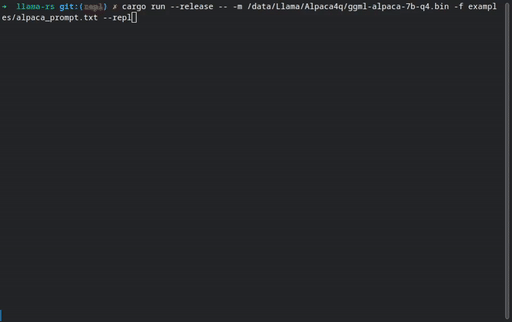
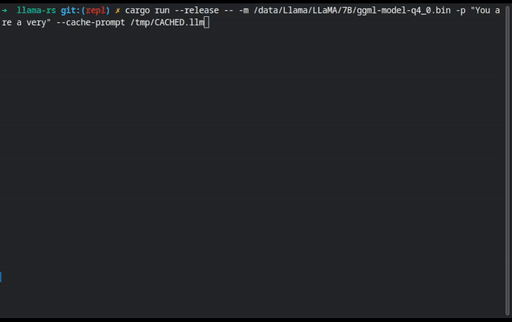

# LLaMA-rs

> Do the LLaMA thing, but now in Rust 🦀🚀🦙


> _Image by [@darthdeus](https://github.com/darthdeus/), using Stable Diffusion_

[](https://ko-fi.com/F1F8DNO5D)

[](https://crates.io/crates/llama_rs)

[](https://discord.gg/YB9WaXYAWU)


**LLaMA-rs** is a Rust port of the
[llama.cpp](https://github.com/ggerganov/llama.cpp) project. This allows running
inference for Facebook's [LLaMA](https://github.com/facebookresearch/llama)
model on a CPU with good performance using full precision, f16 or 4-bit
quantized versions of the model.

Just like its C++ counterpart, it is powered by the
[`ggml`](https://github.com/ggerganov/ggml) tensor library, achieving the same performance as the original code.

## Getting started

Make sure you have a rust toolchain set up.

1. Get a copy of the model's weights[^1]
2. Clone the repository
3. Build (`cargo build --release`)
4. Run with `cargo run --release -- <ARGS>`

Some additional things to try:

- Use `--help` to see a list of available options.
- If you have the [alpaca-lora](https://github.com/tloen/alpaca-lora) weights,
  try `--repl` mode! `cargo run --release -- -m <path>/ggml-alpaca-7b-q4.bin
  -f examples/alpaca_prompt.txt --repl`.

  

- Prompt files can be precomputed to speed up processing using the
  `--cache-prompt` and `--restore-prompt` flags so you can save processing time
  for lengthy prompts. 

  

[^1]: The only legal source to get the weights at the time of writing is [this repository](https://github.com/facebookresearch/llama/blob/main/README.md#llama). The choice of words also may or may not hint at the existence of other kinds of sources.

**NOTE**: For best results, make sure to build and run in release mode. Debug builds are going to be very slow.

For example, you try the following prompt:

```shell
cargo run --release -- -m /data/Llama/LLaMA/7B/ggml-model-q4_0.bin -p "Tell me how cool the Rust programming language is
```

## Q&A

- **Q: Why did you do this?**
- **A:** It was not my choice. Ferris appeared to me in my dreams and asked me
  to rewrite this in the name of the Holy crab.

- **Q: Seriously now**
- **A:** Come on! I don't want to get into a flame war. You know how it goes,
  _something something_ memory _something something_ cargo is nice, don't make
  me say it, everybody knows this already.

- **Q: I insist.**
- **A:** _Sheesh! Okaaay_. After seeing the huge potential for **llama.cpp**,
  the first thing I did was to see how hard would it be to turn it into a
  library to embed in my projects. I started digging into the code, and realized
  the heavy lifting is done by `ggml` (a C library, easy to bind to Rust) and
  the whole project was just around ~2k lines of C++ code (not so easy to bind).
  After a couple of (failed) attempts to build an HTTP server into the tool, I
  realized I'd be much more productive if I just ported the code to Rust, where
  I'm more comfortable.

- **Q: Is this the real reason?**
- **A:** Haha. Of course _not_. I just like collecting imaginary internet
  points, in the form of little stars, that people seem to give to me whenever I
  embark on pointless quests for _rewriting X thing, but in Rust_.

## Known issues / To-dos

Contributions welcome! Here's a few pressing issues:

- [ ] The quantization code has not been ported (yet). You can still use the
      quantized models with llama.cpp.
- [ ] No crates.io release. The name `llama-rs` is reserved and I plan to do
      this soon-ish.
- [ ] Any improvements from the original C++ code. (See https://github.com/setzer22/llama-rs/issues/15)
- [x] Debug builds are currently broken.
- [x] The code needs to be "library"-fied. It is nice as a showcase binary, but
      the real potential for this tool is to allow embedding in other services.
- [x] The code only sets the right CFLAGS on Linux. The `build.rs` script in
      `ggml_raw` needs to be fixed, so inference _will be very slow on every
      other OS_.
